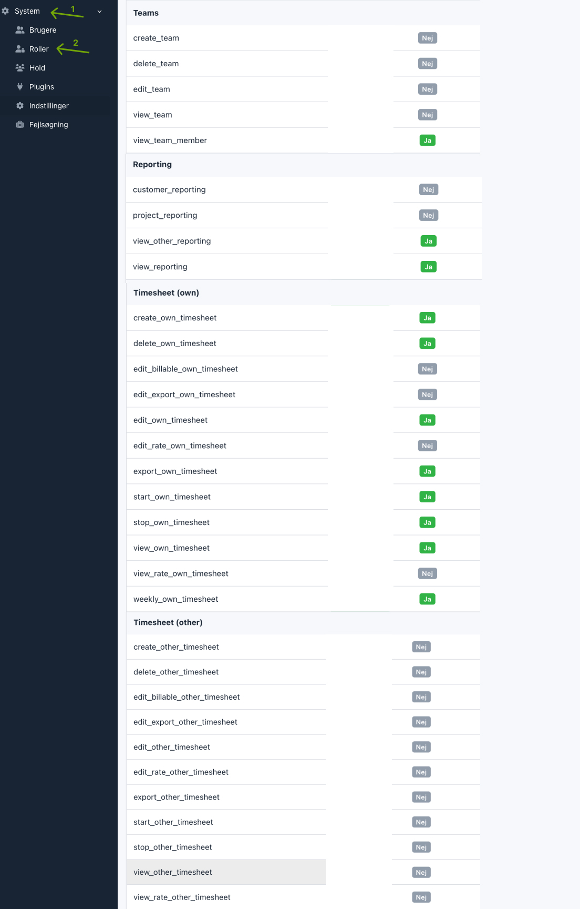

# Aarhus kommune – a Kimai plugin

## Installation

Download [a release](https://github.com/itk-kimai/AarhusKommuneBundle/releases) and extract it to `var/plugins/`.

```shell
# Installs plugin assets to public/bundles/aarhuskommune (note "aarhuskommune", not "aarhus_kommune")
# and applies the plugin's doctrine migrations.
# Use "/bundles/aarhuskommune/" as base path when referencing assets.
bin/console kimai:bundle:aarhus_kommune:install --no-interaction
bin/console kimai:reload --no-interaction
```

See [Install and update Kimai plugins](https://www.kimai.org/documentation/plugin-management.html) for details.

Edit your [`local.yaml`](https://www.kimai.org/documentation/local-yaml.html#localyaml):

``` yaml
# config/packages/local.yaml
aarhus_kommune:
    primary_project: 87
    primary_activity: 42

    # Remove some main menu items by route:
    main_menu:
        remove:
            - route: dashboard
            - route: calendar
            - route: admin_timesheet

    # Web Accessibility Statement URL
    was_url: https://was.digst.dk/tid-aarhuskommune-dk

    # The initial view. Language, timezone and theme are set under
    # kimai.defaults.user.* (see "User language" below).
    user_defaults:
        login_initial_view: 'quick_entry'

# Set route on Tabler logo
tabler:
    routes:
        tabler_welcome: quick_entry

# Defaults for newly provisioned users that the bundle defers to Kimai for.
kimai:
    defaults:
        user:
            language: da
            timezone: Europe/Copenhagen
            theme: default
```

Use `bin/console debug:config AarhusKommuneBundle` to check the active configuration.

## Features

### Login form

The username and password fields on the login form are hidden by default, but they can be summoned by adding
`#admin-login` to URL (i.e. `/en/login#admin-login`).

A login message can be defined on `/en/admin/system-config/#conf_aarhuskommune_config` and this message is shown on the
login form.

### Web Accessibility Statement

The path `/was` (route name: `aarhuskommune_was`) or `/{_locale}/was` (route name: `aarhuskommune_was_locale`) will
redirect to the Web Accessibility Statement URL defined in `local.yaml`.

### User language

New users (including those provisioned on first SAML login) get their `language`,
`timezone` and `theme` from Kimai's native `defaults.user.*` configuration, while
the initial view comes from the bundle's `user_defaults`. The formatting locale
follows the language. Set the Kimai defaults in `local.yaml`:

``` yaml
# config/packages/local.yaml
kimai:
    defaults:
        user:
            language: da
            timezone: Europe/Copenhagen
            theme: default
```

Kimai derives the UI language solely from the `{_locale}` segment of the URL, so a
stale `/en/` bookmark, browser history or a post-login target URL renders the wrong
language even when the user's language preference says otherwise. To prevent this,
authenticated `GET` requests whose URL locale does not match the user's preferred
language are redirected to the same path with the correct locale prefix, keeping the
URL as the source of truth. When a user has no explicit language preference, the
redirect falls back to the same `kimai.defaults.user.language` value.

### App template overrides

To override the app template `templates/partials/ticktack.html.twig`, say, create a template in
`Resources/views/app/partials/ticktack.html.twig`:

``` twig
{# Resources/views/app/partials/ticktack.html.twig #}

{# Use `@App` to refer to the original template #}
{{ include('@App/partials/ticktack.html.twig') }}
```

The path after `Resources/views/app/` _must_ match the path after `templates/partials/` exactly.

Another example:

``` twig
{# Resources/views/app/base.html.twig #}



    <div class="float-help">
        <a href="https://aarhuskommune.dk/tid" target="_blank" accesskey="h" title="{{ 'help'|trans }}">
            <i class="fas fa-question"></i>
        </a>
    </div>
    <div class="mb-4"></div>

```

## Development

``` shell
git clone --branch develop https://github.com/itk-kimai/AarhusKommuneBundle var/plugins/AarhusKommuneBundle
bin/console kimai:reload --no-interaction
```

Rather that hard copying plugin assets (cf. [Installation](#installation) above), you can run

``` shell
bin/console assets:install --symlink
```

to [symlink](https://en.wikipedia.org/wiki/Symbolic_link) the `public` folder.

### Coding standards and tooling

A `docker-compose.yml` file with a PHP 8.4 image is included in this project.
A [Taskfile](https://taskfile.dev/) is used to run common development tasks.

Set up the project (start the containers and install dependencies) with

``` shell
task setup
```

Run all CI checks locally (coding standards, static analysis):

``` shell
task pr:actions
```

Check all coding standards (PHP, Twig, Markdown, YAML, composer):

``` shell
task lint
```

Fix coding standards:

``` shell
task lint:php:fix
task lint:twig:fix
task lint:markdown:fix
task lint:yaml:fix
```

Run static analysis:

``` shell
task analyze:php
```

Run `task --list` to see all available tasks.

_Note_: During development you should remove the `vendor/` folder to not confuse Kimai's autoloading.

## Configuration from the admin

### Weekly hours

We only want one row visible so we set "Minimum number of rows" to 1 in on `admin/system-config/#conf_quick_entry`


### App icon

Use a custom app icon for login and top of header.
Paste this `/bundles/aarhuskommune/touch-icon-192x192.png` path to the "Logo" field on `admin/system-config/#conf_branding`


### User permissions

We set these permissions for the user role. Everything else is disabled.


### Teamlead permissions

We set these permissions for the teamlead role. Everything else is disabled.


## Release

A GitHub release is created when a tag matching `*.*.*` is pushed (cf. the
[`Create Github Release` workflow](.github/workflows/create-release.yaml)).

The workflow builds a versioned `AarhusKommuneBundle-<tag>.tar.gz` archive with
`git archive` and attaches it to the release. The tag is written into
`composer.json` so Kimai reports the correct plugin version (and the plugin
uses it as the stylesheet cache-buster), while development tooling and CI
config are left out via `export-ignore` in `.gitattributes`. Download this
archive and extract it to `var/plugins/`.
